# Proyecto - CI6450

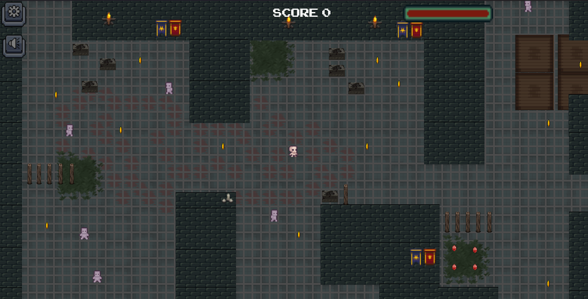

## Objetivo y dinámicas del juego

Llegar al pasillo final y lograr abrir el cofre. Se deben recoger monedas y evitar a los enemigos para mantener la vida del personaje sobre 0. Para poder ingresar al pasillo final se necesita un score mayor a 380.

Algunos de los enemigos cuentan con vida, al acercarse al jugador y a la zona del suelo en rojo pierden la vida poco a poco, una vez su vida está lo suficientemente baja, se recargan en la zona cercana a las banderas. Por otro lado, la zona cercana a las velas es usada por los enemigos como una zona de visibilidad, para vigilar al jugador y la zona en donde se encuentran los jarrones es la zona utilizada por los enemigos para detenerse y lanzar proyectiles.

En los pasillos que poseen barriles los enemigos pueden recargar su vida y además será difícil para ellos recorrer el camino de madera, por lo que prefieren pasar por el pasillo debajo de este (pero no siempre).

La vida del jugador se pierde no solo al chocar con los enemigos, sino también al mantenerse junto a ellos, por lo que los enemigos deben ser evitados.

## Última entrega

Para la última entrega se mantuvieron las máquinas de estado de la entrega 3 y los árboles de decisión y máquinas de estado de la entrega 2 que no hacen uso del estado "Follow Path", ya que el pathfinding fue mejorado en la entrega 3. Para la última entrega existen 16 personajes enemigos.

La última entrega puede correrse con F5 o al correr el proyecto de Godot. Para la corrida de este juego es necesario Godot 4. Hay un menú disponible que permite acceder a una versión jugable del juego.

El juego cuenta con sonido, que puede ser desactivado con un botón a la izquierda de la pantalla. También existe un botón de menú que puede pausar el juego, reanudarlo, iniciar un juego nuevo accediendo nuevamente al menú principal y salir. 

# Entregas anteriores

## Primera entrega

1. Descargar Godot 4
2. Abrir Godot e importar el proyecto desde la carpeta en la que se encuentra alojado. 

Al dar click en play se abrirá un menú que permite moverse entre las diferentes escenas que contienen la implementación de los algoritmos de movimiento.

## Segunda entrega

Por default, los personajes están coloreados con un color asociado al estado en el que se encuentran actualmente, para ver el color original de los sprites, tocar la barra de espacio.

Al presionar la tecla s se pueden diferenciar los personajes con un color asociado a la máquina de estados o árbol de decisión que están utilizando.

Para conocer los colores asociados a los estados y los colores de cada máquina o árbol de decisión, presionar la tecla l para visualizar la leyenda de los colores.

Es posible activar y desactivar el grafo visual (nodos y aristas) con ayuda de la tecla enter.

#### La segunda entrega se encuentra en la escena path_finding_visibility_graph.tscn, para correr la implementación se debe correr esta escena

### Máquinas de estado y árboles de decisión

## Estados

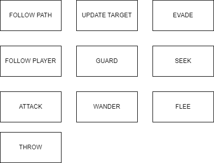

## Decisión 1

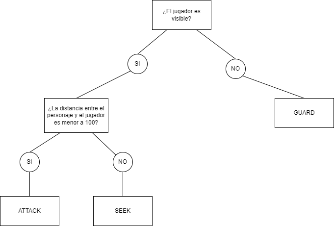

## Decisión 2

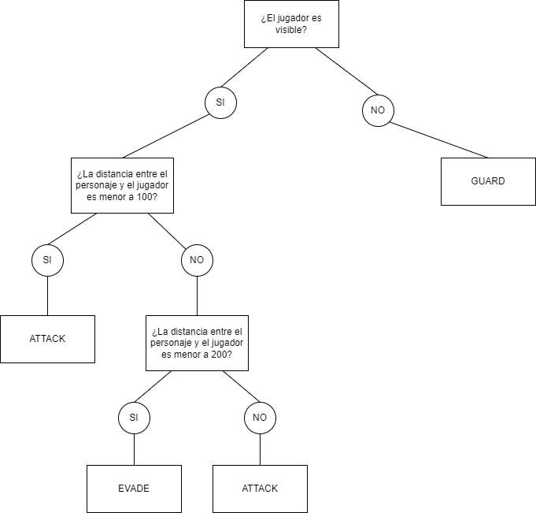

## Decisión 3

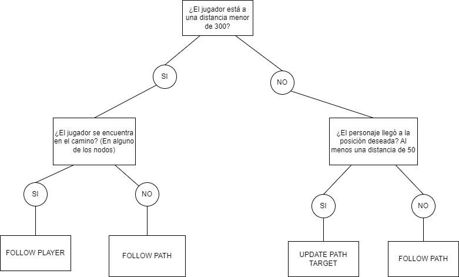

## Decisión 4

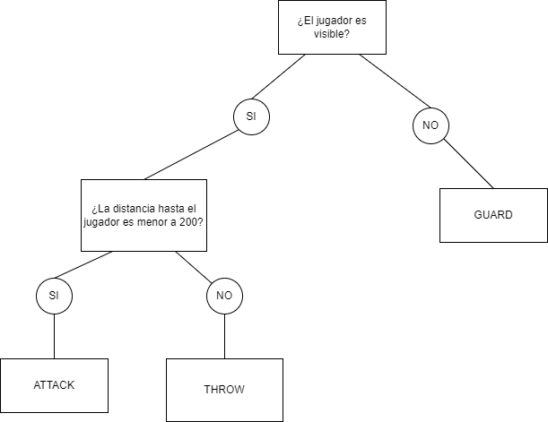

## Decisión 5

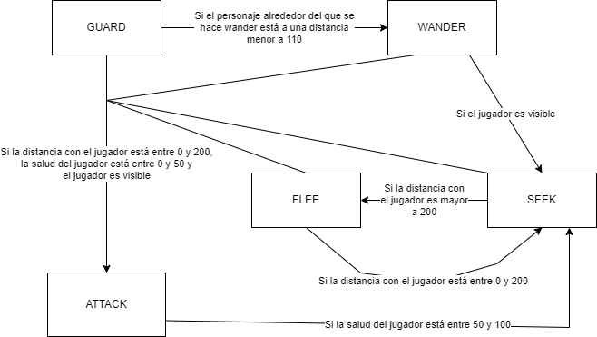

## Decisión 6

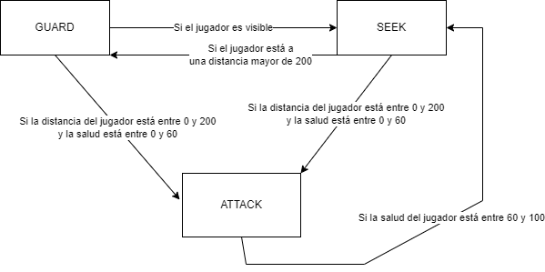

## Decisión 7

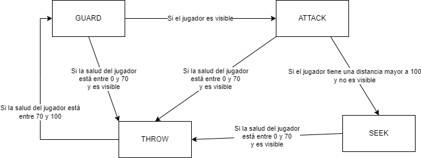

## Decisión 8

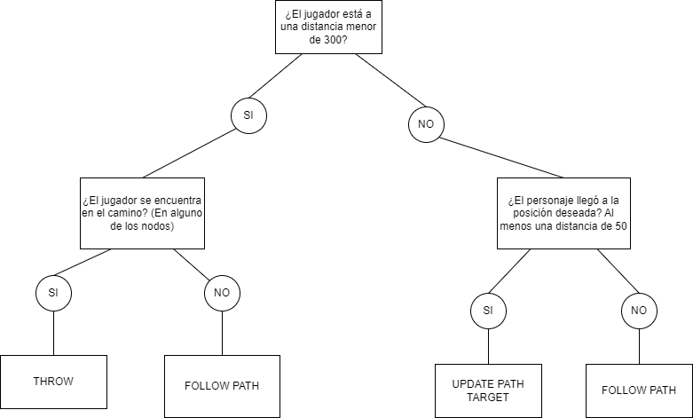

## Decisión 9

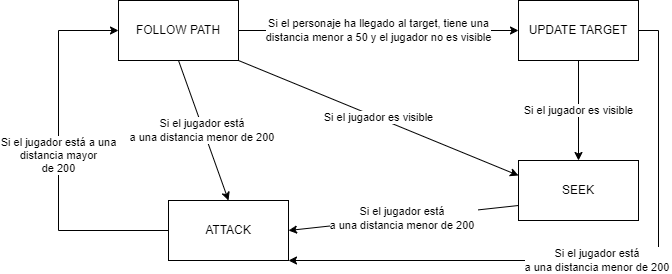

## Tercera Entrega

En la tercera entrega se considera la salud de los enemigos. La salud de los enemigos disminuye al acercarse al jugador y al acercarse a diversos puntos tácticos. Se agregaron los siguientes puntos tácticos:

	Puntos de cover en los que se recarga la salud del enemigo 

	Puntos visuales en los que se detiene el enemigo

	Puntos de sniper en los que se detiene el enemigo para lanzar proyectiles

#### Los puntos tácticos están marcados con varios sprites que pueden verse en la leyenda.

También existen puntos de terreno táctico:

	Zona en rojo disminuye la salud del enemigo, si este se encuentra en la zona

	Zona de barriles aumenta la salud del enemigo, si este se encuentra en la zona

	Zona de madera que es difícil de recorrer para los enemigos

Para esta entrega se agregaron diversas funcionalidades con los siguientes botones:

	ENTER: Activa y desactiva los nodos y los arcos del grafo 

	X : Activa y desactiva todas las líneas existentes hasta el momento

	ESPACIO : Elimina los colores del sprite del enemigo

	L : Muestra la leyenda con los colores asociados a las decisiones, los estados y los puntos tácticos

	S : Diferencia los personajes segun la leyenda por la máquina de estado utilizada por cada uno

	D : Activa o desactiva la capacidad de morir, si está activada el jugador muere si su salud es menor 
 	a 0, sino sigue el juego.

	1,2,3,4,5 - Muestra solo el personaje asociado a cada número (según la máquina de estado que usa) 
	y las líneas de su pathfinding (El personaje 5 solo hace pathfinding)

	0 : Muestra todos los personajes

	W : Hace visibles/invisibles los sprites de los nodos tácticos

Las líneas que se generan para el pathfinding de los enemigos son del mismo color que el color asociado al enemigo
según su máquina de estado, solo el enemigo 5 hace únicamente pathfinding y no está asociado a ninguna máquina de estado. El color más claro indica el camino generado por A* y el color más oscuro indica el camino generado por el A* táctico. Como se indica en la siguiente figura:

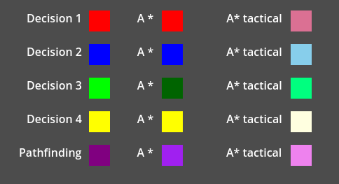

### Máquinas de estado

## Estados de las máquinas de estado

## Máquina 1

## Máquina 2

## Máquina 3

## Máquina 4

### Corrida
Para la corrida de la entrega 3 se creó un menú principal que puede accederse al correr el proyecto en Godot o dar click en F5, este menú permite iniciar una nueva partida del juego.

