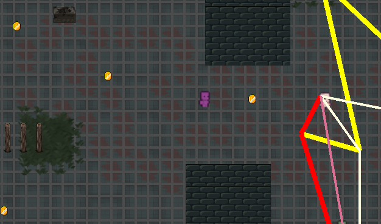
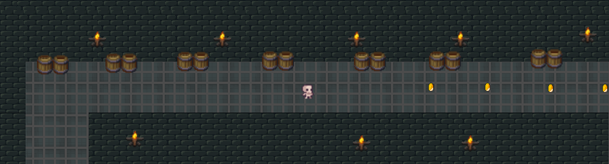
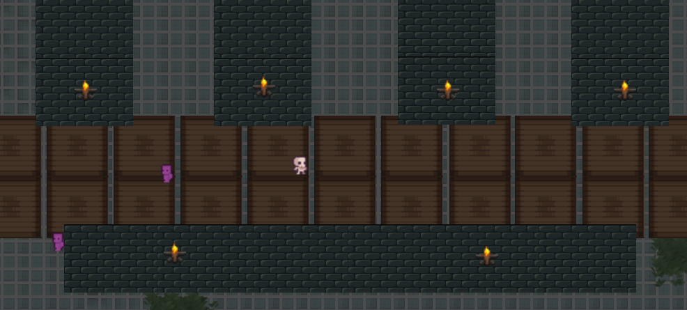
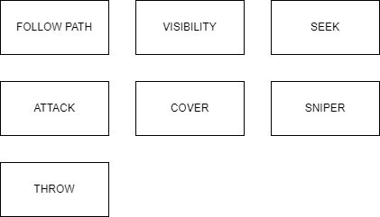
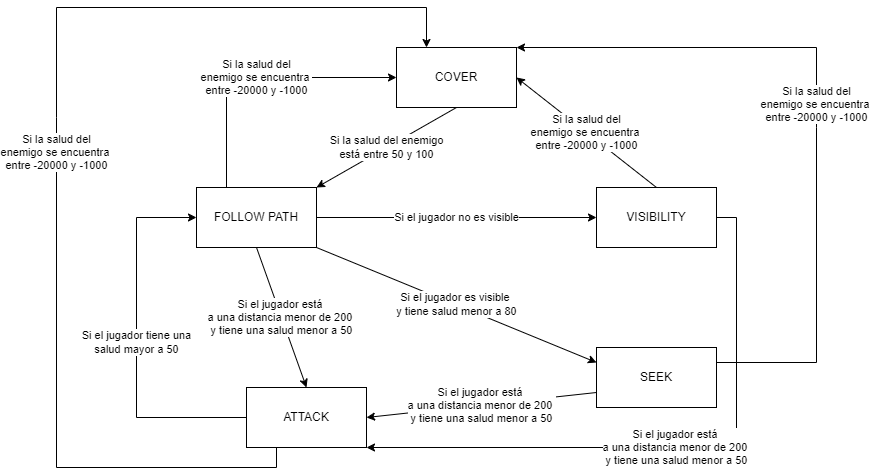
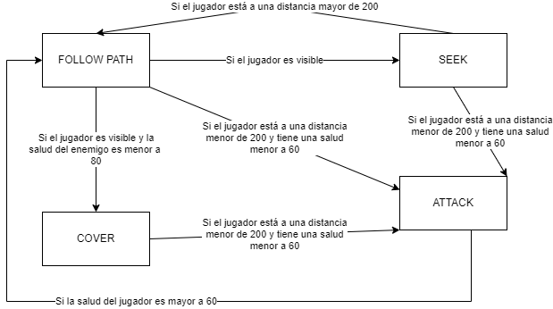
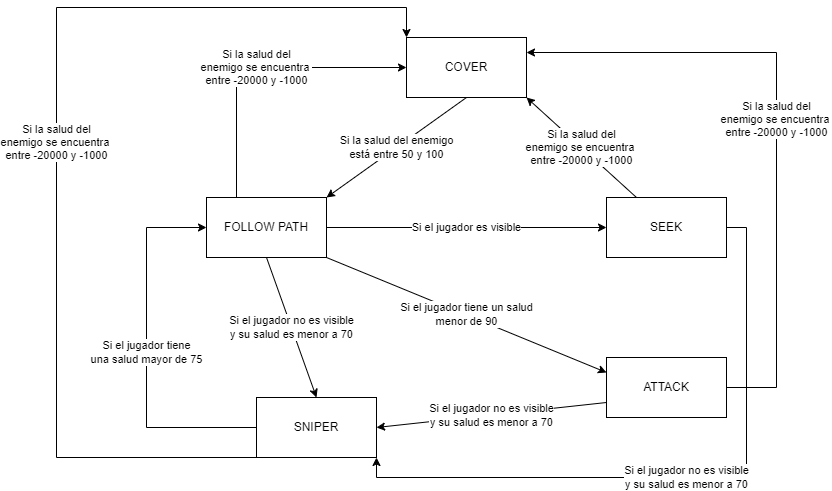
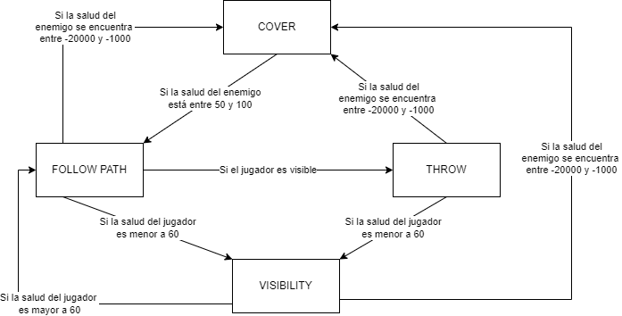

# Proyecto 2 - CI6450

## Cómo usar

1. Descargar Godot 4
2. Abrir Godot e importar el proyecto desde la carpeta en la que se encuentra alojado. 

Al dar click en play se abrirá un menú que permite moverse entre las diferentes escenas que contienen la implementación de los algoritmos de movimiento.

## Segunda entrega

Por default, los personajes están coloreados con un color asociado al estado en el que se encuentran actualmente, para ver el color original de los sprites, tocar la barra de espacio.

Al presionar la tecla s se pueden diferenciar los personajes con un color asociado a la máquina de estados o árbol de decisión que están utilizando.

Para conocer los colores asociados a los estados y los colores de cada máquina o árbol de decisión, presionar la tecla l para visualizar la leyenda de los colores.

Es posible activar y desactivar el grafo visual (nodos y aristas) con ayuda de la tecla enter.

#### La segunda entrega se encuentra en la escena path_finding_visibility_graph.tscn, para correr la implementación se debe correr esta escena

## Tercera Entrega

En la tercera entrega se considera la salud de los enemigos. La salud de los enemigos disminuye al acercarse al jugador y al acercarse a diversos puntos tácticos. Se agregaron los siguientes puntos tácticos:

	Puntos de cover en los que se recarga la salud del enemigo 

	Puntos visuales en los que se detiene el enemigo

	Puntos de sniper en los que se detiene el enemigo para lanzar proyectiles

#### Los puntos tácticos están marcados con varios sprites que pueden verse en la leyenda.

También existen puntos de terreno táctico:

	Zona en rojo disminuye la salud del enemigo, si este se encuentra en la zona

	Zona de barriles aumenta la salud del enemigo, si este se encuentra en la zona

	Zona de madera que es dificil de recorrer para los enemigos

Para esta entrega se agregaron diversas funcionalidades con los siguientes botones:

	ENTER: Activa y desactiva los nodos y los arcos del grafo 

	X : Activa y desactiva todas las líneas existentes hasta el momento

	ESPACIO : Elimina los colores del sprite del enemigo

	L : Muestra la leyenda con los colores asociados a las decisiones, los estados y los puntos tácticos

	S : Diferencia los personajes segun la leyenda por la máquina de estado utilizada por cada uno

	D : Activa o desactiva la capacidad de morir

	1,2,3,4,5 - Muestra solo el personaje asociado a cada número (según la máquina de estado que usa) 
	y las líneas de su pathfinding (El personaje 5 solo hace pathfinding)

	0 : Muestra todos los personajes

	W : Hace visibles/invisibles los sprites de los nodos tácticos

### Máquinas de estado

## Estados de las máquinas de estado

## Máquina 1

## Máquina 2

## Máquina 3

## Máquina 4

